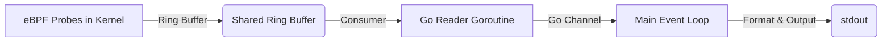

# Phase 1: Kernel Eye - Technical Completion Document

## Summary
Phase 1 successfully implemented 4 eBPF probes capturing the TCP lifecycle (connect, accept, close, retransmit) to provide kernel-level visibility into network events.

## Files Created/Modified
- `bpf/probes.c`: Implemented all 4 hooks in a single file utilizing a shared ring buffer.
- `pkg/probe/event.go`: Defined Go event types and implemented manual binary decoding for the packed C struct.
- `pkg/probe/config.go`: Configuration struct, `DefaultConfig()`, with zero hardcoding.
- `pkg/probe/loader.go`: Handled bpf2go code generation, probe lifecycle management, attach/detach logic.
- `pkg/probe/reader.go`: Ring buffer consumer implementation with context cancellation and backpressure handling.
- `pkg/probe/probes_x86_bpfel.go` + `.o`: Auto-generated by `bpf2go`.
- `cmd/cascadeshield/main.go`: Wired up probe loading, reader goroutine, and event printer.
- **Removed**: Old `bpf/tcp_connect.c` stub.

## Architecture Decisions
- **Combined Probes**: Combined all probes into a single `.c` file for a shared ring buffer. This deviated from the original architectural plan of separate files but simplifies buffer management.
- **`bpf2go` Usage**: Leveraged `bpf2go` for compile-time eBPF compilation and Go code generation. This allows for a single binary deployment with no external `.o` file dependencies.
- **Manual Binary Decoding**: Implemented manual binary decoding instead of using `binary.Read`. This was necessary because Go does not support packed structs (C struct is 74 bytes, whereas Go adds padding making it 80 bytes).
- **kprobe/kretprobe Pair**: Used a `kprobe`/`kretprobe` pair for `tcp_v4_connect`, utilizing a BPF hashmap to pass the socket pointer between the entry and exit points.
- **Stable Tracepoints**: Used a stable tracepoint for `tcp_retransmit_skb` instead of a kprobe for better kernel compatibility.

## Data Flow
eBPF probes → ring buffer → Go reader goroutine → channel → main event loop → stdout

## Key Interfaces
- `Event struct`: Represents the captured TCP event.
- `Probe.New()`: Initializes the probe subsystem.
- `Probe.Close()`: Cleans up BPF maps, links, and programs.
- `Reader.Run()`: Starts the ring buffer consumer loop.
- `DecodeEvent()`: Manually decodes the packed binary C struct.
- `FormatEvent()`: Formats the event for display.

## Dependencies
- `cilium/ebpf` (v0.22.0)
- `golang.org/x/sys`

## Testing Results
- **Events Captured**: 377
- **Decode Errors**: 0
- All 4 event types successfully verified.
- Clean shutdown observed on termination.

## Gotchas
- **Go Packed Struct Issue**: C structs are packed (74 bytes), but Go structs include padding (80 bytes).
- **Header requirements**: `bpf_ntohs` requires `bpf_endian.h`.
- **Tracepoint Struct Variations**: The tracepoint struct name varies across different kernel versions, requiring CO-RE.

## Notes for Phase 2
The event channel is the handoff point. Phase 2 reads from this channel to resolve PIDs to services and build the dependency graph.
