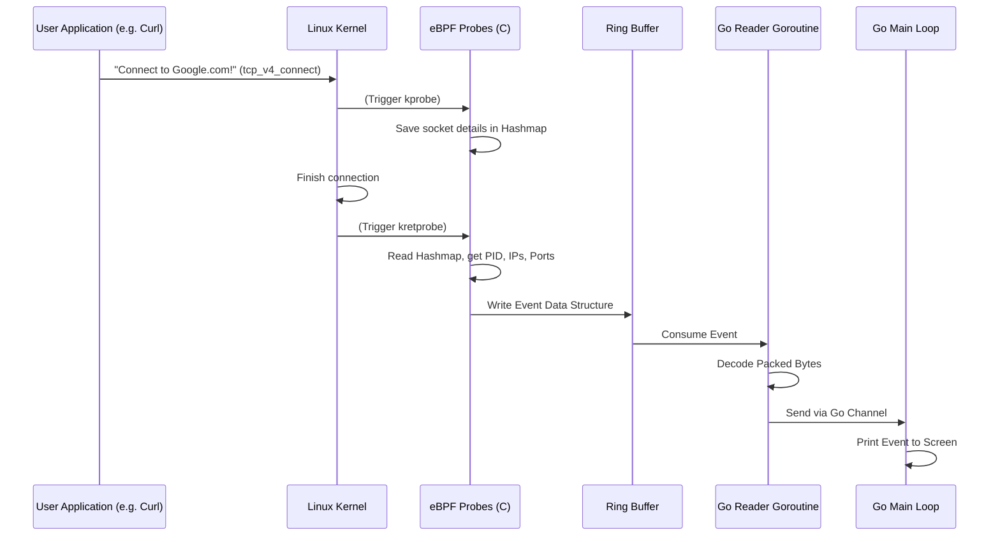

# CascadeShield: Phase 1 Deep Dive

Welcome! If you're reading this, you're looking to understand exactly how CascadeShield taps into the Linux kernel to watch network traffic. This document is written for someone with a solid grasp of computer science basics (like Python, data structures, OS concepts) but who might be completely new to Go and eBPF.

We'll cover what we built in Phase 1, why we built it this way, and how all the moving parts fit together.

---

## 1. Summary of Previous Phase
**Phase 0** was all about setting the stage. We set up our Go modules, configured our build tools (like `Makefile`), and made sure we could compile basic code. It was the foundation.

**Phase 1** (this phase) is where the real magic happens. We built the **Kernel Eye**. We wrote code that lives directly inside the Linux kernel to watch every TCP connection being created, accepted, closed, or struggling (retransmitting).

---

## 2. What Was Done
In simple English: We placed "spies" (eBPF probes) inside the Linux kernel's networking code. Whenever any program on the computer opens a network connection, closes it, or drops a packet, our spies write a tiny report about it. Then, our Go application running in user space collects all these reports in real-time and prints them to the screen.

---

## 3. Why It Was Done (And Why Not Just Use Logs?)
You might wonder: *Why go through the trouble of putting code inside the kernel? Why not just read log files or use tools like `tcpdump`?*

1. **Visibility**: Not every application logs its network connections. Even if they do, they don't use a standard format.
2. **Speed & Efficiency**: Tools like `tcpdump` capture the entire network packet, which is incredibly slow and CPU-intensive. Our eBPF probes only grab the *metadata* (like IP addresses, ports, and Process IDs) right when the event happens.
3. **Context**: Network packets don't contain the Process ID (PID) of the program that sent them. By hooking into the kernel functions that the application calls, we can instantly know exactly *which* program is making the connection.

---

## 4. Key Concepts Explained (With Analogies)

Before we look at the code, let's understand the vocabulary.

### 4.1 eBPF Probes: kprobes and kretprobes
Think of the kernel as a busy corporate office. Functions are the employees doing specific jobs.
- **kprobes (Kernel Probes)**: This is like putting a wiretap on a specific employee's phone. The moment they pick up (the function is called), our code runs. We get to see what they were asked to do (function arguments).
- **kretprobes (Kernel Return Probes)**: This is like waiting by the door to see what an employee brings back after finishing their job. Our code runs exactly when the function is done, letting us see the result (return value).

### 4.2 Tracepoints vs kprobes
- **kprobes**: Like climbing through a window to spy. They are powerful, but if the kernel developers change the name of the internal function or how it works (remodeling the office), your kprobe will break.
- **Tracepoints**: Like the official visitor's entrance. The kernel developers have explicitly provided stable "hooks" in the code for tools to attach to. They rarely change between kernel versions.

### 4.3 BPF Maps (Hashmaps)
Imagine you have a spy at the entrance (kprobe) and a spy at the exit (kretprobe). They need to share information. They can't shout to each other. Instead, they use a shared notepad. A **BPF Map** is that notepad. The entry spy writes down some details with a specific ID (like a thread ID), and the exit spy reads those details using the same ID.

### 4.4 Ring Buffers
A **Ring Buffer** is a circular conveyor belt. The eBPF spies in the kernel are producing reports extremely fast. They place these reports onto the conveyor belt. Our Go application (in user space) sits at the other end, taking the reports off the belt as fast as it can. Because it's a circle, it keeps spinning and reusing space safely without constantly asking for new memory.

### 4.5 bpf2go
Writing eBPF means writing C code. Writing our main app means writing Go code. How do they meet? `bpf2go` is like a robot that automatically compiles your C code into an eBPF binary format and wraps it in a nice Go package. It means you don't have to carry around `.o` files; it's all baked right into your single Go executable!

### 4.6 Goroutines and Channels
- **Goroutines**: Think of them as super lightweight threads. If standard threads are buses, goroutines are bicycles. You can have thousands of them running at the same time in a Go program without slowing down the system.
- **Channels**: A pipe that goroutines use to pass data to each other safely. If Goroutine A reads from the ring buffer, it puts the data into a channel. Goroutine B (the main loop) listens on the other end of the pipe and prints the data out.

### 4.7 Context Cancellation
A `context` in Go is like a walkie-talkie that says "everyone stop what you're doing and go home." When the user presses Ctrl+C, we trigger the context cancellation. Every goroutine listening to that context immediately cleans up its toys and exits gracefully.

### 4.8 CO-RE / BTF
Different Linux versions have differently shaped data structures in their kernels. **CO-RE (Compile Once - Run Everywhere)**, powered by **BTF (BPF Type Format)**, acts as a universal adapter. It automatically adjusts your eBPF code on the fly when it loads to match the exact shape of the kernel it happens to be running on. 

### 4.9 Packed Structs
In C, you can declare a `struct` (a collection of variables) as "packed". This means "fit this furniture tightly into the moving van with absolutely no gaps between boxes." 
Go, however, likes to add "spacers" (padding) to align things neatly in memory for the CPU. Because our C code sends a tightly packed struct, our Go code cannot just blindly map it to a padded Go struct. We had to write manual decoding logic to read exactly the right bytes.

---

## 5. How It Was Done: Architecture & Data Flow

Here is how data moves through our system:



---

## 6. Code Walkthrough

Let's look at the most important files and see how the concepts map to the code.

### 6.1 `bpf/probes.c` (The Kernel Spies)

We combined all our probes into a single C file. This lets them easily share the same Ring Buffer.

```c
// 1. Define the layout of the report we will send to Go.
// __attribute__((packed)) forces the compiler to leave NO gaps.
struct tcp_event {
    __u64 timestamp;
    __u32 pid;
    char comm[16];
    __u32 saddr; // Source IP
    __u32 daddr; // Dest IP
    __u16 sport; // Source Port
    __u16 dport; // Dest Port
    __u8 type;   // Is this a connect, accept, close?
} __attribute__((packed));

// 2. Define the shared BPF Ring Buffer (the conveyor belt)
struct {
    __uint(type, BPF_MAP_TYPE_RINGBUF);
    __uint(max_entries, 256 * 1024); // 256 KB of buffer space
} events SEC(".maps");

// 3. Define a Hashmap (the notepad) for the connect kprobe/kretprobe pair
struct {
    __uint(type, BPF_MAP_TYPE_HASH);
    __uint(max_entries, 10240);
    __type(key, __u32); // Thread ID
    __type(value, struct sock *); // Pointer to socket details
} connect_sockets SEC(".maps");

// 4. The kprobe: Triggers right BEFORE tcp_v4_connect executes
SEC("kprobe/tcp_v4_connect")
int BPF_KPROBE(tcp_v4_connect_entry, struct sock *sk) {
    __u32 tid = bpf_get_current_pid_tgid();
    // Write down the socket pointer in the notepad under our Thread ID
    bpf_map_update_elem(&connect_sockets, &tid, &sk, BPF_ANY);
    return 0;
}

// 5. The kretprobe: Triggers right AFTER tcp_v4_connect is done
SEC("kretprobe/tcp_v4_connect")
int BPF_KRETPROBE(tcp_v4_connect_exit, int ret) {
    __u32 tid = bpf_get_current_pid_tgid();
    struct sock **skpp;
    
    // Read the notepad
    skpp = bpf_map_lookup_elem(&connect_sockets, &tid);
    if (!skpp) return 0; // If not found, skip it

    // ... (Code to extract IPs, ports, and PID) ...
    
    // Reserve space on the conveyor belt
    struct tcp_event *event = bpf_ringbuf_reserve(&events, sizeof(*event), 0);
    if (event) {
        // Fill out the report
        event->type = 1; // Connect
        event->pid = tid >> 32;
        // Submit the report to Go
        bpf_ringbuf_submit(event, 0);
    }
    
    // Clean up the notepad
    bpf_map_delete_elem(&connect_sockets, &tid);
    return 0;
}
```

### 6.2 `pkg/probe/loader.go` (The bpf2go Magic)

This file tells Go how to handle the C code. Notice the magic `//go:generate` comment.

```go
package probe

// This comment is read by the `go generate` command.
// It tells the bpf2go robot: "Compile probes.c into eBPF, and generate Go code for it."
//go:generate go run github.com/cilium/ebpf/cmd/bpf2go -type tcp_event bpf ../../bpf/probes.c -- -I../../bpf/headers

type Probe struct {
    objs bpfObjects // Auto-generated struct holding loaded eBPF programs
    // ...
}

func New() (*Probe, error) {
    p := &Probe{}
    // Load the compiled eBPF code into the kernel
    if err := loadBpfObjects(&p.objs, nil); err != nil {
        return nil, err
    }
    // ... attach the kprobes to the actual kernel functions ...
    return p, nil
}
```

### 6.3 `pkg/probe/event.go` (Manual Binary Decoding)

Because C packs the struct (74 bytes) and Go doesn't, we have to unpack it manually byte by byte. 

```go
package probe
import "encoding/binary"

type Event struct {
    Timestamp uint64
    PID       uint32
    Comm      string
    // ...
}

// DecodeEvent takes raw bytes from the ring buffer and maps them to our Go struct
func DecodeEvent(data []byte) Event {
    var e Event
    // Read the first 8 bytes as a 64-bit integer (Timestamp)
    e.Timestamp = binary.LittleEndian.Uint64(data[0:8])
    
    // Read the next 4 bytes as a 32-bit integer (PID)
    e.PID = binary.LittleEndian.Uint32(data[8:12])
    
    // The C struct had Comm as a char[16]. 
    // We convert those specific bytes into a Go string.
    e.Comm = string(data[12:28]) 
    
    // ... continue for IPs and Ports ...
    return e
}
```

### 6.4 `pkg/probe/reader.go` (The Conveyor Belt Consumer)

This file runs as a background "goroutine". It constantly pulls reports off the ring buffer and sends them down a channel.

```go
package probe

// Run starts the infinite loop to read from the ring buffer
func (r *Reader) Run(ctx context.Context, eventsChan chan<- Event) {
    for {
        // Check if the "walkie-talkie" told us to stop
        select {
        case <-ctx.Done():
            return // Exit gracefully
        default:
        }

        // Pull the next report off the conveyor belt
        record, err := r.ringbufReader.Read()
        if err != nil {
            continue
        }

        // Unpack the C struct bytes into a Go struct
        event := DecodeEvent(record.RawSample)

        // Send the Go struct down the channel pipe to the main loop
        eventsChan <- event
    }
}
```

### 6.5 `cmd/cascadeshield/main.go` (The Maestro)

The main file orchestrates everything. It sets up the context (walkie-talkie), loads the eBPF probe, creates the channel (pipe), starts the reader (consumer), and finally sits in a loop printing whatever comes out of the pipe.

```go
package main

func main() {
    // 1. Setup the walkie-talkie to handle Ctrl+C
    ctx, cancel := signal.NotifyContext(context.Background(), os.Interrupt)
    defer cancel()

    // 2. Load the spies into the kernel
    p, _ := probe.New()
    defer p.Close() // Make sure we clean up when we exit

    // 3. Create the pipe (Channel)
    eventsChan := make(chan probe.Event, 1000) // Buffer of 1000 events

    // 4. Start the conveyor belt reader in a lightweight thread (Goroutine)
    reader, _ := probe.NewReader(p)
    go reader.Run(ctx, eventsChan)

    // 5. The Main Event Loop: Sit and wait for reports
    for {
        select {
        case event := <-eventsChan:
            // A report came out of the pipe! Print it.
            fmt.Println(event.FormatEvent())
        case <-ctx.Done():
            // User pressed Ctrl+C. Time to pack up.
            fmt.Println("Shutting down...")
            return
        }
    }
}
```

---

## 7. How It All Connects (And What's Next)

By bringing all these pieces together, we achieved our goal for Phase 1: **Raw Event Capture**. 

1. `curl` makes a connection.
2. The kernel executes `tcp_v4_connect`.
3. Our `kprobe` triggers and records the details.
4. The event travels across the ring buffer.
5. Our Go app decodes it.
6. The event shoots through a Go channel.
7. We print it to the screen.

**So, what's next for Phase 2?**
Right now, our events just dump to `stdout` (the terminal screen). They tell us a PID (Process ID) made a connection, but a number like `1245` isn't very helpful. 
In Phase 2, we will take that **Go Channel** and instead of just printing the events, we will pass them to a new system that looks up PID `1245` and realizes it's the `nginx` service, and then builds a visual map (dependency graph) of which services are talking to each other.

The pipe we built here is the foundation for everything to come!
