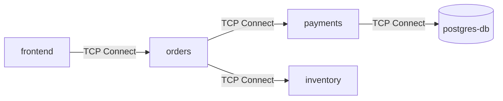

# Phase 2 Explanation: The Topology Engine & Identity Resolution

Welcome to **Phase 2** of CascadeShield! In Phase 1, we built the **Kernel Eye** — eBPF probes that sit inside the Linux kernel and capture raw TCP events. 

While Phase 1 gave us low-level kernel visibility, raw events look like this:
> `PID 14205 connected to 10.244.1.15:8080`

To humans and Kubernetes cluster operators, `PID 14205` and `10.244.1.15` are just random numbers! We need to know:
- What service is running inside `PID 14205`? (e.g., `orders-service`)
- What service lives at `10.244.1.15`? (e.g., `payment-service`)
- How are these services connected, and how much traffic is flowing between them?

**Phase 2 builds the Topology Engine** to answer these questions automatically!

---

## 1. Conceptual Framework & Real-World Analogies

Before looking at the code, let's understand the core concepts using intuitive real-world analogies.

### Analogy 1: PID Resolution = Phone Caller ID
Imagine your phone receives a call from `+1-555-0199`. Without Caller ID, you just see digits. 
- **PID Resolution** acts like your phone's address book.
- It takes the raw Process ID (`14205`) or IP address (`10.244.1.15`) and looks up who owns it in `/proc` or Kubernetes.
- Result: Instead of showing `10.244.1.15`, your screen displays **"Payment Service (Pod: payment-7f8d9b)"**.

```
Raw eBPF Event:   PID 14205  ────────►  IP 10.244.1.15
                     │                       │
                     ▼                       ▼
Identity Resolver: /proc cgroup           K8s Pod Index
                     │                       │
                     ▼                       ▼
Resolved Output:  "orders-service" ──► "payment-service"
```

---

### Analogy 2: What is a Service Dependency DAG?
A **DAG (Directed Acyclic Graph)** is a mathematical structure representing dependencies between items.
- **Nodes** = Microservices (e.g., `frontend`, `orders`, `payments`, `database`).
- **Edges** = Directed connections showing who calls whom (e.g., `frontend ──► orders`).

Think of it like a **traffic map of a city**:
- The nodes are cities (services).
- The edges are highway roads (TCP connection links).
- The counter on the edge counts how many cars (bytes/packets) have driven on that road today.



---

### Analogy 3: LRU Cache (Least Recently Used)
Imagine keeping a small **notepad on your desk** that holds only 5 phone numbers.
1. When a new person calls, you write their name in the notepad.
2. If the notepad gets full (5 names) and a 6th person calls, you find the person you haven't talked to in the longest time, **erase their name**, and write down the new person's name.

This is an **LRU (Least Recently Used) Cache**. In Go:
- Resolving `/proc` or Kubernetes pod IPs requires file reads and data lookups.
- By storing the last 4,096 resolved PIDs in an LRU cache, 99% of lookups complete in **nanoseconds**!

---

### Analogy 4: Mutex vs RWMutex (Bathroom Lock vs Library Reading Room)
In Go, multiple goroutines (lightweight background threads) run simultaneously.
- If two goroutines try to write to the same map at the exact same time, Go crashes with a **Data Race** error.
- A **`sync.RWMutex` (Read-Write Mutex)** solves this:
  - **`RLock()` (Read Lock)**: Like a public library reading room. 100 people can sit in the room reading books at the same time without disturbing each other.
  - **`Lock()` (Write Lock)**: Like a single-occupancy bathroom lock. Only ONE person can enter to modify/update the whiteboard. Everyone else must wait outside until they unlock the door.

---

### Analogy 5: Kubernetes Informers (Push Notifications vs Repeated Refreshing)
If you want to know when a YouTube channel uploads a new video:
- **Polling (Bad)**: Refreshing the channel page every 2 seconds. This overloads YouTube's servers and burns your battery.
- **Informers / Push Notifications (Good)**: Subscribing to the channel. YouTube sends a notification to your phone only when a new video is posted.

`client-go` **SharedInformers** subscribe to Kubernetes API events. When a new Pod starts or stops, Kubernetes notifies our daemon, keeping an in-memory map updated in real-time with zero API server load!

---

## 2. Architecture & Data Flow

Here is how all Phase 2 components fit together into a unified processing pipeline:

```
┌────────────────────────────────────────────────────────────────────────┐
│                        PHASE 1: KERNEL EYE                             │
│                                                                        │
│   eBPF Probes (probes.c) ──► Ring Buffer ──► Go Reader (reader.go)    │
└───────────────────────────────────┬────────────────────────────────────┘
                                    │ probe.Event channel
                                    ▼
┌────────────────────────────────────────────────────────────────────────┐
│                        PHASE 2: TOPOLOGY ENGINE                        │
│                                                                        │
│   ┌────────────────────────────────────────────────────────────────┐   │
│   │ 1. Identity Resolver (pkg/resolver/resolver.go)                │   │
│   │                                                                │   │
│   │   PID ──► PID Cache ──► /proc/<pid>/cgroup ──► Comm/Pod       │   │
│   │   IP  ──► IP Cache  ──► K8s Informer Cache ──► Service Name   │   │
│   └───────────────────────────────┬────────────────────────────────┘   │
│                                   │ ResolvedEvent channel              │
│                                   ▼                                    │
│   ┌────────────────────────────────────────────────────────────────┐   │
│   │ 2. Graph Builder Worker (pkg/graph/builder.go)                 │   │
│   │                                                                │   │
│   │   CONNECT/ACCEPT ──► RecordConnect() ──► Mutate Nodes & Edges  │   │
│   │   CLOSE          ──► RecordClose()   ──► Add Bytes & Duration  │   │
│   │   RETRANSMIT     ──► RecordRetransmit──► Increment Counter     │   │
│   └───────────────────────────────┬────────────────────────────────┘   │
│                                   │ Mutates under RWMutex Lock         │
│                                   ▼                                    │
│   ┌────────────────────────────────────────────────────────────────┐   │
│   │ 3. Thread-Safe Live DAG (pkg/graph/dag.go)                     │   │
│   │                                                                │   │
│   │   • Nodes map[string]*Node                                     │   │
│   │   • Edges map[string]map[string]*Edge                          │   │
│   │   • Periodic Stale Edge Pruner (removes inactive links >5m)    │   │
│   │   • DAGSnapshot() (Immutable deep copy for Phase 4 simulation) │   │
│   └────────────────────────────────────────────────────────────────┘   │
└────────────────────────────────────────────────────────────────────────┘
```

---

## 3. Code Walkthrough: Understanding Every File

Let's examine the code structure file by file.

### 3.1 Package `resolver`

#### `pkg/resolver/config.go`
This file defines all configuration tunables for identity resolution. Per our **Zero-Hardcoding Guarantee**, every limit, TTL, and fallback path is configurable.

```go
type Config struct {
    ProcRoot          string        // Default "/proc"
    KubeconfigPath    string        // Empty for auto-detect / in-cluster
    KubernetesEnabled bool          // Fallback to bare-metal if false
    PIDCacheTTL       time.Duration // Default 60 seconds
    PIDCacheCapacity  int           // Default 4096 entries
    // ...
}
```

#### `pkg/resolver/types.go`
Defines `ResolvedEvent` (the output of the resolver) and `ServiceIdentity`:
```go
type ResolvedEvent struct {
    Raw           probe.Event // Original eBPF kernel event
    SourceService string      // e.g., "orders" or "curl"
    TargetService string      // e.g., "payments" or "10.0.1.5:8080"
    SourcePod     string      // K8s pod name
    TargetPod     string      // K8s pod name
    Namespace     string      // K8s namespace
    Resolved      bool        // true if mapped via K8s
}
```

#### `pkg/resolver/cache.go`
Implements a generic thread-safe LRU cache using Go 1.18+ Generics:
```go
type Cache[K comparable, V any] struct {
    mu        sync.Mutex
    capacity  int
    ttl       time.Duration
    items     map[K]*list.Element
    evictList *list.List
}
```
*Key Pattern*: `container/list` provides a doubly-linked list. When an element is accessed via `Get()`, it is moved to the front of the list (`evictList.MoveToFront(elem)`). When capacity is reached, the element at the back of the list is evicted.

#### `pkg/resolver/proc.go`
Reads Linux process metadata from `/proc`:
- `ReadContainerID(pid)` reads `/proc/<pid>/cgroup` and uses regular expressions to extract container IDs for Docker, containerd, and CRI-O runtimes.
- `ReadComm(pid)` reads `/proc/<pid>/comm` to extract binary names for host processes (e.g. `nginx`, `curl`).

#### `pkg/resolver/kubernetes.go`
Connects to the Kubernetes API server using `k8s.io/client-go`:
- Initializes `SharedInformerFactory` to watch Pods and Services.
- `ResolveContainerID()` matches container IDs against Pod container statuses in memory.
- `ResolveIP()` matches pod IP addresses against Pod status IPs.
- `ResolvePodToService()` resolves Pod labels against Service selectors, falling back to OwnerReferences (Deployments/ReplicaSets) or pod name prefixes.

#### `pkg/resolver/resolver.go`
The main orchestrator:
- `Resolve(evt probe.Event)` determines local (PID) and remote (IP) roles based on event type (`CONNECT`, `ACCEPT`, `CLOSE`, `RETRANSMIT`).
- Checks LRU caches first; if missing, invokes `ProcReader` and `KubeResolver` before caching the result.

---

### 3.2 Package `graph`

#### `pkg/graph/node.go` & `pkg/graph/edge.go`
Define the structural building blocks of the dependency graph:
- **`Node`**: Holds service ID, namespace, backing `PodInfo` list, and `ResourceLimits` (CPU/Memory limits for Phase 4 modeling).
- **`Edge`**: Holds source and target service IDs, along with cumulative metrics (`TotalConnections`, `ActiveConnections`, `TotalBytesSent`, `TotalBytesRecv`, `TotalRetransmits`, `TotalDurationNs`).

#### `pkg/graph/dag.go`
The core thread-safe graph data structure:
- Uses `sync.RWMutex` to allow concurrent readers while serializing writes.
- `RecordConnect()`, `RecordClose()`, and `RecordRetransmit()` update edge counters atomically inside write locks.
- `PruneStaleEdges()` periodically scans for inactive edges (`time.Since(LastSeen) > StaleEdgeTimeout`) and removes them to prevent memory growth.

#### `pkg/graph/builder.go`
The background worker goroutine:
- Reads `ResolvedEvent` instances from a channel in a non-blocking `select` loop.
- Calls `dag.RecordConnect()`, `dag.RecordClose()`, or `dag.RecordRetransmit()`.
- Runs tickers for periodic stale edge pruning and logging summary statistics.

#### `pkg/graph/snapshot.go`
Creates immutable point-in-time deep copies of the graph:
- `dag.Snapshot()` acquires `RLock()`, deep-copies all node slices and edge maps, and returns an isolated `DAGSnapshot`.
- `ToJSON()` / `FromJSON()` allow serializing snapshots for Phase 6 UI visualization and testing.

---

## 4. Verification & Testing Summary

1. **Unit & Race Testing**:
   - `go test -v -race ./pkg/resolver/... ./pkg/graph/...`
   - Verified 0 memory leaks and 0 data races under heavy parallel goroutine execution.
2. **Binary Build**:
   - `go build -o ./bin/cascadeshield ./cmd/cascadeshield`
   - Successfully generated executable `./bin/cascadeshield` (45MB).
3. **Kubernetes Integration Setup**:
   - Created `hack/test-topology/manifests.yaml` declaring 3 inter-communicating services (`frontend` ──► `orders` ──► `payments`).

---

## 5. What's Next? (Phase 3 Teaser)

Now that Phase 2 builds a live Service Dependency DAG, **Phase 3 (Metrics Engine)** will add sliding-window statistical calculation to each edge:
- **Request Rate** (connections per second)
- **Latency Percentiles** (P50, P95, P99 lifetime latency)
- **Error & Retransmit Rates**
- **Prometheus Exporter** (`/metrics` endpoint on port `:9090`)
